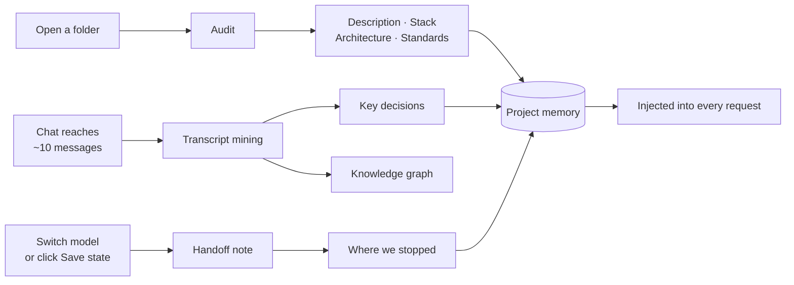

<div align="center">


# Magnetar

**An AI IDE with persistent project memory.**

The project is at the centre — not the model. Models are interchangeable
executors; what they know about your codebase stays behind when they leave.

Local-first · bring your own key · macOS

</div>

---

## The problem it solves

Every AI coding session starts from zero. You explain the architecture again,
re-state the decisions you already made, and paste the same files. Switch models
— even to a better one — and all of it evaporates.

Magnetar keeps that context **outside the conversation**, in a project memory
that survives new chats, app restarts and model swaps. When you switch from one
model to another, the outgoing model writes down where it stopped, and the next
one continues from that note instead of re-reading your repository.

The result: less time re-explaining, fewer tokens spent on rediscovery, and a
model that is a swappable part rather than the thing you organise your work
around.

---

## What is inside

| Surface | What it does |
|---|---|
| **Project memory** | Facts, tech stack, architecture, coding standards, key decisions and "where we stopped" — collected automatically, editable by hand, injected into every request |
| **Agent** | Reads, writes and edits files, searches the code, runs shell commands. Every edit is reviewable and revertible |
| **Editor** | Monaco (the engine behind VS Code) with tabs, side-by-side diffs and TypeScript IntelliSense — bundled locally, no CDN |
| **Source control** | Branch, staging, commit, diff, log, fetch/pull/push |
| **Terminal** | A real PTY in the project root, sharing the shell the agent uses |
| **Problems** | Runs the project's own type-check, linter and tests; output is parsed into a clickable list |
| **Code search** | Local BM25 index — ranked search with no embeddings and no network |
| **Knowledge graph & roadmap** | Entities and relations mined from your work; a Kanban board of tasks |
| **Subscriptions** | Open ChatGPT / Claude / Gemini / DeepSeek in a built-in browser and move project context in and out by hand |

---

## How project memory actually fills

This is the heart of the product, so it is worth being precise. Four different
triggers write to memory, each on a cheap background model:



Every one of those writes reports into a **memory log** in the project panel —
success, failure and the reason. Background work that fails silently is how
memory ends up mysteriously empty, so nothing here fails silently.

A chat feeds memory only while it is attached to a project. The app manages that
binding for you and tells you plainly when a chat is not attached.

---

## Bring your own key

No subscription to Magnetar, no proxy, no account. You connect the providers you
already pay for:

- **OpenAI-compatible** — OpenRouter, Moonshot / Kimi, Together, OpenAI itself,
  and local runtimes like Ollama or LM Studio
- **Anthropic** — native adapter (`/v1/messages`, `tool_use` blocks)
- **GigaChat** — OAuth with token caching, and the Russian Trusted Root CA
  bundled so it works without manual certificate setup

Tool use is detected by behaviour, not assumed from the provider: if a model
ignores the `tools` field, the agent replays the turn through a text-based ReAct
protocol automatically. That is what makes weaker and free-tier models usable as
agents at all.

---

## Privacy

- API keys live in the **macOS Keychain**, never in files, localStorage or git
- Conversations, memory and the code index live in a local **SQLite** database
- The app talks to exactly the endpoints you configured — there is no telemetry,
  no analytics and no "home" to phone

---

## Getting started

```bash
npm install
npm run tauri dev
```

Requirements: Node 20+, Rust stable (`rustup`), Xcode Command Line Tools.

Then, in this order — it matters:

1. **Connect a model.** Key icon at the bottom of the rail → pick a provider →
   paste your key → *Test*.
2. **Open a project folder.** The folder *is* the project: Magnetar creates it,
   builds the code index and collects the first facts. Agent mode turns itself
   on.
3. **Work in one chat.** Decisions start landing in memory as the conversation
   grows.
4. **Switch models freely.** The handoff note is written for you.

New to the interface? The **`i`** button at the top of the rail turns on hint
mode: hover any control to learn what it does and when it runs.

### Building a release

```bash
npm run tauri build          # → src-tauri/target/release/bundle/
bash scripts/sign-app.sh     # local signing, see below
```

macOS treats an unsigned rebuild as a different program, so the Keychain keeps
asking for permission. `scripts/setup-signing.sh` creates a local self-signed
identity once and fixes that. It is a developer certificate, not an Apple
Developer ID: the build is not notarised and is not meant for distribution to
other machines.

---

## Architecture

```
src-tauri/src/
  providers/       Provider trait + OpenAI-compatible, Anthropic, GigaChat adapters
  canon.rs         Provider-neutral transcript (sessions, messages)
  workspace.rs     Projects, tasks, knowledge graph, timeline, connections
  tools.rs         Agent tools, git, process control
  index.rs         BM25 code index
  pty.rs           Terminal sessions
  keychain.rs      macOS Keychain wrapper
src/
  components/shell/    Rail, status bar, command palette, terminal dock
  components/panels/   Files, Search, Git, Problems, Changes, Project memory
  components/editor/   Monaco editor and diff viewer
  lib/                 Store, agent loop, handoff, memory, problems, theme, i18n
```

The core abstraction is the **provider-neutral canon**: one transcript that each
adapter serialises into its own provider's format. Switching models mid-task is
a serialisation detail, not a context loss.

---

## Project status

Version 0.1.0, macOS, actively built. Honest state of things:

**Works and is used daily** — chat and agent across all three provider families,
editor, git, terminal, code search, project memory with its log, roadmap,
knowledge graph, subscriptions bridge, light and dark themes, RU/EN/ES interface.

**Rough edges**
- Built and tested on Intel macOS; a universal build is one flag away
  (`--target universal-apple-darwin`) but is not part of the routine
- Not notarised — the app is for your own machine
- No language server yet: Rust and Python get syntax and search, not
  go-to-definition. This is the largest remaining gap versus a full IDE
- Embedded browser sign-in for Google-backed services needs a compatibility
  toggle, and some sites behave better in a real browser
- The JS bundle is large; Monaco is most of it

**Not built on purpose** — hidden automation of subscription AI web apps. It
breaks their terms of service. The manual context bridge exists instead.

---

## Documentation

- [HANDOFF.md](HANDOFF.md) — the full development journal, entry by entry
- [NEXT_TASK_FILES.md](NEXT_TASK_FILES.md) — current state, rules and file map
- [TEST_SCENARIO.md](TEST_SCENARIO.md) — manual acceptance walkthrough
