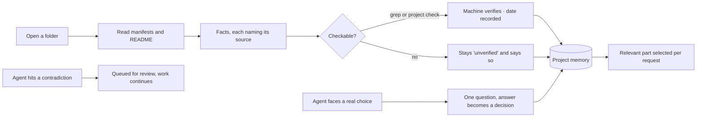

<div align="center">


# Magnetar

**An AI IDE with persistent project memory.**

The project is at the centre — not the model. Models are interchangeable
executors; what they know about your codebase stays behind when they leave.

Local-first · bring your own key · macOS

</div>

---

## The problem it solves

Every AI coding session starts from zero. You explain the architecture again,
re-state the decisions you already made, and paste the same files. Switch models
— even to a better one — and all of it evaporates.

Magnetar keeps that context **outside the conversation**, in a project memory
that survives new chats, app restarts and model swaps. When you switch from one
model to another, the outgoing model writes down where it stopped, and the next
one continues from that note instead of re-reading your repository.

The result: less time re-explaining, fewer tokens spent on rediscovery, and a
model that is a swappable part rather than the thing you organise your work
around.

---

## What is inside

| Surface | What it does |
|---|---|
| **Project memory** | Facts that carry where they came from and whether a machine confirmed them — stack, architecture, constraints, current state. Collected automatically, editable by hand, selected per request |
| **Decision log** | What was decided, when, why, what was rejected, which files it touches, at which commit |
| **Agent** | Reads, writes and edits files, searches the code, runs shell commands. Every edit is reviewable and revertible |
| **Discussion track** | A conversation with its own model and no tools: talk the task through, then hand the prompt to the agent |
| **Generation Studio** | Full-screen image and video studio: a data-driven model registry (settings render from each model's params) with an optional LLM prompt-refinement step before generation |
| **Editor** | Monaco (the engine behind VS Code) with tabs, side-by-side diffs, AI inline completion (ghost text), and real language intelligence over LSP — hover, go-to-definition, rename, references, completion and diagnostics — bundled locally, no CDN |
| **Language servers** | Real LSP clients for Rust (rust-analyzer), Python (Pyright), Go (gopls) and TypeScript/JavaScript, spawned by the Rust backend and offered with an install hint when a server is missing |
| **Debugger** | Debug Adapter Protocol client — breakpoints, stepping, call stack, scopes, variables and expression evaluation. Python (debugpy) and Rust (lldb-dap, with an automatic `cargo build` and binary resolve) are wired end-to-end; other adapters are offered with an install hint |
| **Source control** | Branch, staging, commit, diff, log, fetch/pull/push |
| **Terminal** | A real PTY in the project root, sharing the shell the agent uses |
| **Problems** | Runs the project's own type-check, linter and tests; output is parsed into a clickable list |
| **Code search** | Local BM25 index — ranked search with no embeddings and no network, and no file cap (measured to 50k files) |
| **Knowledge graph & roadmap** | Entities and relations mined from your work; a Kanban board of tasks |
| **Subscriptions** | Open ChatGPT / Claude / Gemini / DeepSeek in a built-in browser and move project context in and out by hand |

---

## How project memory actually works

This is the heart of the product, so it is worth being precise.

Memory is made of **facts**, not paragraphs. Every fact records where it came
from and whether anyone checked it, because a coder — human or model — has to be
able to tell these two apart:

```
- SQLite via rusqlite      [read from src-tauri/Cargo.toml; verified 2026-08-21]
- Hexagonal architecture   [stated by the user; unverified]
```

A false fact is worse than a missing one: the missing one sends you to look, the
false one gets trusted.



Four things follow from this design:

- **Machines verify what machines can verify.** "We use SQLite" is a grep over
  the dependency manifests; a model asked to confirm its own memory would simply
  agree with itself.
- **Nothing is born verified.** Facts start unverified and stay that way until
  something actually looked.
- **Only the relevant part is sent.** Dumping all of memory into every prompt is
  tens of thousands of tokens in which the two useful lines drown. Constraints
  and stack go whole; the rest is selected against the request, under a hard cap.
- **Contradictions queue, they do not interrupt.** Confirmation fatigue is what
  makes people switch approvals off entirely, so a model that finds memory wrong
  leaves a note and keeps working.

Every background write reports into a **memory log** in the project panel —
success, failure and the reason. Background work that fails silently is how
memory ends up mysteriously empty, so nothing here fails silently.

---

## Bring your own key

No subscription to Magnetar, no proxy, no account. You connect the providers you
already pay for:

- **OpenAI-compatible** — OpenRouter, Moonshot / Kimi, Together, OpenAI itself,
  and local runtimes like Ollama or LM Studio
- **Anthropic** — native adapter (`/v1/messages`, `tool_use` blocks)
- **GigaChat** — OAuth with token caching, and the Russian Trusted Root CA
  bundled so it works without manual certificate setup

Tool use is detected by behaviour, not assumed from the provider: if a model
ignores the `tools` field, the agent replays the turn through a text-based ReAct
protocol automatically. That is what makes weaker and free-tier models usable as
agents at all.

---

## Privacy

- API keys live in the **macOS Keychain**, in a single encrypted entry.
  A release build never writes a key to disk in the clear under any
  circumstance. The only fallback is a `0600` `secrets.json` in **debug builds**,
  for an unsigned developer build the Keychain refuses; keys found in that old
  file are migrated into the Keychain and the file deleted. Keys are never kept
  in SQLite, localStorage or git
- Conversations, memory and the code index live in a local **SQLite** database
- The app talks to exactly the endpoints you configured — there is no telemetry,
  no analytics and no "home" to phone. This is **enforced**, not just promised:
  outbound requests go through a host allowlist seeded from the connections you
  save (plus the built-in GigaChat hosts), so a compromised page cannot redirect
  a request to a host it invents

---

## Getting started

```bash
npm install
npm run tauri dev
```

Requirements: Node 20+, Rust stable (`rustup`), Xcode Command Line Tools.

Then, in this order — it matters:

1. **Connect a model.** Key icon at the bottom of the rail → pick a provider →
   paste your key → *Test*.
2. **Pick a background model.** Settings → Project memory. Memory is collected
   on this model; without one, nothing gets collected.
3. **Open a project folder.** The folder *is* the project: Magnetar creates it,
   builds the code index, collects the first facts and verifies the checkable
   ones. The agent track turns itself on.
4. **Work.** Use the **Agent** tab to change the project, the **Discussion** tab
   to think out loud, and the **Generation** tab to produce images, video or
   audio — each keeps its own model. "To agent" under a reply moves a prompt
   from one to the other.
5. **Switch models freely.** The handoff note is written for you.

New to the interface? The **`i`** button at the top of the rail turns on hint
mode: hover any control to learn what it does and when it runs.

### Verifying a change

Six gates, all offline — no API key and no network are needed:

```bash
npm run typecheck
npm run lint
npm run test:unit -- --run
npm run build
cargo test --manifest-path src-tauri/Cargo.toml
npm run smoke
```

Formatting is available too (`npm run format` / `npm run format:check`, Prettier),
though it is not yet enforced as a gate.

The smoke fixture is generated into the OS temp directory; set
`MAGNETAR_FIXTURE_DIR` to put it somewhere else. Targets and current baseline
numbers are in [`docs/QUALITY_GATES.md`](docs/QUALITY_GATES.md).

### Building a release

```bash
npm run build:app            # build + local signing, in one step
```

Building and signing are one operation, not two. An unsigned rebuild is a
different program as far as macOS is concerned, and the Keychain then asks for
your password on every launch rather than once. Signed, it asks once per build:
reopening the app is silent, and a rebuild asks a single time — the keys are
kept in one Keychain item rather than one per connection, so the prompt does not
multiply by the number of providers. `npm run build:app` runs
`npm run tauri build` and then `scripts/sign-app.sh`, which is why forgetting
the second half is no longer possible. The bundle lands in
`src-tauri/target/release/bundle/`.

macOS treats an unsigned rebuild as a different program, which is why signing
matters even locally. `scripts/setup-signing.sh` creates a local self-signed
identity once and gives the app a stable identity across rebuilds. It is a developer certificate, not an Apple
Developer ID: the build is not notarised and is not meant for distribution to
other machines.

---

## Architecture

```
src-tauri/src/
  providers/       Provider trait + OpenAI-compatible, Anthropic, GigaChat adapters
  canon.rs         Provider-neutral transcript (sessions, messages)
  workspace.rs     Projects, memory facts, decisions, divergences, tasks, graph
  tools.rs         Agent tools, git, process control
  index.rs         BM25 code index
  pty.rs           Terminal sessions
  keychain.rs      Secret storage (Keychain-first; 0600 secrets.json only in debug) + migration
  utf8.rs          Incremental UTF-8 decoding for streamed output
src/
  components/shell/    Rail, status bar, command palette, terminal dock
  components/panels/   Files, Search, Git, Problems, Changes, Project memory
  components/editor/   Monaco editor and diff viewer
  lib/                 Store, agent loop, generation studio (registry + run chain),
                       guards, memory facts, verification, decisions, divergences,
                       relevance, problems, theme, i18n
```

The core abstraction is the **provider-neutral canon**: one transcript that each
adapter serialises into its own provider's format. Switching models mid-task is
a serialisation detail, not a context loss.

---

## Project status

Version 0.1.0, macOS, actively built. This is a development build, not a
public release. The authoritative delivery plan and acceptance criteria are in
[`docs/IMPLEMENTATION_PLAN.md`](docs/IMPLEMENTATION_PLAN.md).

**Works and is used daily** — chat, agent and the generation studio across the
provider families, editor with AI inline completion and LSP navigation, git,
terminal, code search, project memory with provenance and machine verification,
the decision log, the divergence queue, roadmap, subscriptions bridge, durable
agent runs with per-run rollback, light and dark themes, RU/EN/ES interface.

**Recently landed** (development phases)
- Durable agent runs: each run is persisted through an append-only event log, a
  per-run token budget stops it with an explainable reason, and file changes are
  grouped by run so a whole task can be rolled back. On startup, runs left
  in flight are reconciled — **marked interrupted and surfaced**, not resumed;
  replaying an interrupted run from its event log is future work (Phase 1)
- AI inline completion — ghost text in the editor (Phase 2)
- Generation gallery persisted to SQLite (Phase 3)
- Code index O(n²) initial sync fixed — 50k files from 621s to 5.6s, and the
  5,000-file cap removed (Phase 4)

**Rough edges and release blockers**
- Built and tested on the current development Mac; universal build and
  notarization are not complete
- LSP is present for Rust, Python, Go and TypeScript/JavaScript (hover,
  definition, rename, references, completion, diagnostics, formatting), but
  parser fallback and some navigation edges are incomplete
- The debugger speaks DAP end-to-end for Python (debugpy) and Rust (lldb-dap,
  built with `cargo build` first). Rust needs `lldb-dap` present — LLVM 18+ /
  Xcode 16+, or `brew install llvm`; on older toolchains it is offered with an
  install hint. Node's adapter is not bundled
- MCP support is deferred
- One folder at a time: multi-root is deliberately not built, see
  [`docs/IMPLEMENTATION_PLAN.md`](docs/IMPLEMENTATION_PLAN.md)
- Monaco is split into its own lazy ~4.45 MB (~1.14 MB gzip) chunk via
  `manualChunks`, separate from the app shell (~447.93 KB gzip); the size
  warning now trips only on that deliberately-large editor chunk
- Embedded browser sign-in for Google-backed services needs a compatibility
  toggle, and some sites behave better in a real browser

**Not built on purpose** — hidden automation of subscription AI web apps. It
breaks their terms of service. The manual context bridge exists instead.

---

## Documentation

- [OVERVIEW.md](OVERVIEW.md) — the full account of the product: philosophy, how
  memory works, the agent, providers, data, and why each decision was made
  (Russian)
- [HANDOFF.md](HANDOFF.md) — the full development journal, entry by entry
- [NEXT_TASK_FILES.md](NEXT_TASK_FILES.md) — current state, rules and file map
- [TEST_SCENARIO.md](TEST_SCENARIO.md) — manual acceptance walkthrough
- [docs/IMPLEMENTATION_PLAN.md](docs/IMPLEMENTATION_PLAN.md) — current audit,
  parity matrix, acceptance criteria and ordered delivery steps
- [docs/QUALITY_GATES.md](docs/QUALITY_GATES.md) — required checks and budgets
- [docs/SECURITY.md](docs/SECURITY.md) — security baseline and release controls
- [docs/ARCHITECTURE.md](docs/ARCHITECTURE.md) — architecture and trust boundaries
- [docs/RELEASE_CHECKLIST.md](docs/RELEASE_CHECKLIST.md) — release gate status
- [CHANGELOG.md](CHANGELOG.md) — unreleased changes
